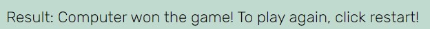
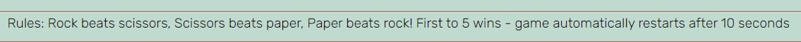

# Table of contents
1. [Welcome](#welcome)
2. [Features](#features)
    - [Header](#header)
    - [Buttons](#buttons)
    - [Scores](#scores)
    - [Result](#result)
    - [User and computer areas](#usercomputerareas)
    - [Footer](#footer)
3. [Testing](#testing)
    - [Feature testing](#featuretesting)
    - [Validator](#validatortesting)
    - [Responsiveness](#responsivetesting)
    - [Lighthouse](#lighthousetesting)
    - [Other testing](#othertesting)
4. [Deployment](#deployment)
5. [Content Credits](#credits)

## Welcome!

This website is a game of rock, paper and scissors. It is targeted towards any user who wishes to play the game. The design is intuitive, meaning that it is clear to the user that in order to play they must make a selection from one of the 3 buttons (rock, paper or scissors). This is also explianed to the user in the section with shows their choice and the computer's choice; on loading the website, this displays the text 'make a choice'.

The rules of the game are outlined in the footer. These are the traditional rules for a rock, paper, scissors game: rock beats scissors, scissors beats paper, paper beats rock. There is an additional rule in this specific game which is that the first player to reach the score of '5' wins the game. Players can then press 'reset' to start a new game. If they do not press anything, the game will automatically reset after 10 seconds. The buttons are also disabled once a score of 5 is reached, so players cannot continue playing until a new game is started.

## Features 

### Header 

The header provides the name of the game (rock, paper, scissors). This informs the user of the type of game they can expect to see on the page.

### Buttons 

The first button that the player will see will be the button that they can use to enter their name. The game will work even if they do not use this button, however it makes the experience more personalized. The button contains an onclick attribute in the html file, which calls a function when the button is clicked on. What the player experiences is a pop up box asking for their name. Once they enter a name into the box, the 'your' in 'your score' and 'your choice' text changes to their name.

There are three buttons that the user can use to make their choice selection: rock button, paper button and scissors button.

 An event listener has been added to these buttons in javascript, which calls a function. This function targets the 'id' of the buttons (rock, paper, scissors), to determine which choice the user has made. The function then calls the other game functions: to determine the computer choice, to change the image, to calculate scores and winner and to end the game.

After making a selection and clicking a button, the player can expect to see the following changes:

- user image changes from the placeholder image to the image of the option they selected
- 'your choice' text will display their selection in text format
- a computer choice function will also run and the same above changes will occur on the 'computer choice' div on the right hand side.
- the winner is checked, through a javascript function, and this is displayed in text beside 'result'
- scores are adjusted depending on who won points

There is a fifth button called 'reset'. The user can press this at any time during the game and it will reset the scores back to zero, the result to blank, the image to the placeholder image and the 'your choice' text to 'make a choice'. It will also reset their name, if they have entered a name. This function is called by using the 'onclick' attribute directly in the index.html file. The 'onclick' calls a function called gameReset, which changes all of the above points (image, text, scores, result, name). 

The event handlers for all buttons are therefore set up in two different ways; for the choice buttons this is achieved through an event listener and for the result button and name button through the use of onclick.

As the rule of this game is that the first to 5 wins, the reset function is automatically called when either the player or the computer reaches a score of 5. There is a 10 second delay on this to allow the user time to read the scores and see who one the last choice. The message that the user receives in the 'result' section will also prompt them to start a new game by pressing 'reset'. The choice buttons become disabled at this point and clicking on them will not produce any effect. This means that the user cannot keep playing until the game has been reset and the buttons become enabled again.

### Scores 

The score area provides information on the player score and the computer score. Each time the player wins or draws, their score is increased. This also happens for the computer score. Scores will reset to 0 either when the reset button is pressed or when the round is finished and someone reached the score of 5. 

This happens through the use of a function called checkScore and a variable called score. In the checkWinner function, the variable score is provided with 3 different inputs based on the outcome of the round (you won, you lost, its a draw). For example, if the outcome of the round is 'you won', the score variable will be assigned 'player'. In the checkScore function, an if/else statement increases the player score or the computer score, or both, depending on the content of the 'score' variable. For example, if the result variable contains the text 'you lost!', then the score variable will contain 'computer'. Within the checkScore function, the computer score will be increased because the score variable contains 'computer'.

### Result 

The result provides information in text format every time a selection is made by the player. The possible options are 'you won', 'you lost' and 'its a draw'. This section will also display the winner of the game (first to 5) in text format, along with a prompt for the user to press reset to start again.

The result is determined through the checkWinner function. This function contains if/else statements based on both the player choice and computer choice. For example, if the player choice is 'rock' and the computer choice is 'paper', then the result text would be 'you lost'. A variable called 'score' is also updated with the winner('player' or 'computer'), this variable is then used in the next function which calculates the scores (checkScores).

### User and computer areas 

These areas provide information on the choice that has been made by both the user and the computer. Before any selection has been made, they contain a placeholder image and texts that says 'make a choice'. After a selection has been made, this image changes to an image that represents the choice (e.g. picture of paper). This image change occurs for both the user section and the computer section. With this feature, players are able to see both in text and in image format what their choice is and what the computer has chosen. This is done through the use of functions and if/else statements, for example if the user choice is 'paper', the image src is changed to display that image. If/else statements are also used to change the text, based on the button that is clicked by the user.

While the user choice is displayed based on the button the user clicks (through the use of event listeners), the computer choice is calculated by using math.random and an array of choices. Math.random (combined with math.floor) is multiplied by 3, producing a possible result of 0, 1 or 2, which is assigned to a variable. This variable is then used to pull a value from the array list of choices, for example 0 means that 'rock' would be displayed, 1 would display 'paper' and so forth.

### Footer 

The footer area contains the rules of the game. Players can read this to understand what the rules are and how they can win.

------

## Testing 

### Feature testing 

Features were tested by clicking on all of the different buttons and and functions of the game, to determine if they perform the tasks that they are supposed to.

| Action        | Expected Behaviour  | Result | 
| ------------- | ------------- | ------------- | 
| Enter url of site in browser  | site shows homepage | pass | 
| Click name button  | a prompt appears asking to enter name | pass | 
| Click name button and enter name  | user score and choice text changes to their name | pass | 
| Click on rock/paper/scissors buttons  | player's choice is shown in text  | pass | 
| Click on rock/paper/scissors buttons  | computer choice is shown in text  | pass | 
| Click on rock/paper/scissors buttons | image changes depending on user and comp choice | pass |
| Click on rock/paper/scissors buttons | a winner result is displayed and scores update  | pass |
| Click on reset button | scores, images, name, result and choice text reset  | pass |
| Player/computer reaches score of 5  | game resets after 10 seconds  | pass |
| Player/computer reaches score of 5   | rock/paper/scissors buttons disabled| pass |
| Player/computer reaches score of 5 | result message displays winner of game | pass |

### Validator testing 

HTML validator testing passed (https://validator.w3.org/):

CSS validator testing passed (https://jigsaw.w3.org/css-validator/):

Javascript validator testing passed (https://jshint.com/) without errors.

### Responsiveness testing

There is one media query in the css file, for smaller screens (max-width: 450px). This changes the font size and width of the user and computer display areas, and aligns the buttons to display 'inline'. This was tested by using Chrome developer tools and viewing the website through the different device options available on the developer tools. Other site features were styled with percentages, allowing them to be responsive on different devices without the need for media queries.

### Lighthouse testing

Lighthouse testing was done on both mobile and desktop versions of the game.

Mobile:

Desktop:

### Other testing

Once the site was deployed, the live version was viewed on different screen sizes and all features tested again. This included buttons and ensuring that images changed, scores updated and the game ended correctly when a user or the computer reached the score of 5.

------

## Deployment 

 GitHub pages: The site was deployed to GitHub pages through settings -> pages. The live link for the site is https://caoimhed.github.io/game/

 Local deployment: This was deployed though command prompt.

 

---

## Content credits 

Colour scheme developed on: https://coolors.co/379634-f4f1bb-ad5d4e-231b1b-bddbd0

Icons/images taken from: icon-icons.com
