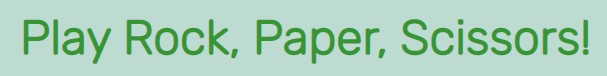

# Table of contents
1. [Welcome](#welcome)
2. [Features](#features)
    1. [Header](#header)
    2. [Buttons](#buttons)
    3. [Scores](#scores)
    4. [Result](#result)
    5. [User and computer areas](#usercomputerareas)
    6. [Footer](#footer)
3. [Testing](#testing)
4. [Deployment](#deployment)
4. [Content Credits](#credits)

## Welcome! 

This website is a game of rock, paper and scissors. It is targeted towards any user who wishes to play the game. The design is intuitive, meaning that it should be clear to the user that in order to play they make a selection from one of the 3 buttons (rock, paper or scissors). This is also explianed to the user in the section with shows their choice and the computer's choice; on loading the website, this displays the text 'make a choice'.

The rules of the game are outlined in the footer. These are the traditional rules for a rock, paper, scissors game: Rock beats scissors, Scissors beats paper, Paper beats rock. There is an additional rule in this specific game which is that the first player to reach the score of '5' wins the round. Players can then press 'reset' to start a new round. If they do not press anything, the game will automatically reset after 10 seconds.

## Features 

### Header 

The header provides the name of the game (rock, paper, scissors). This informs the user of the type of game they can expect to see on the page.

### Buttons 

There are three buttons that the user can use for their choice: rock button, paper button and scissors button. An event listener has been added to these buttons in javascript, which calls multiple functions. After making a selection and clicking a button, the user can expect to see the following changes:
- user image changes to the image of the option they selected
- 'your choice' text will display their selection in text format
- a computer choice function will also run and the same above changes will occur on the 'computer choice' div on the right hand side.
- the winner is checked, also through a javascript function, and this is displayed in text beside 'result'
- scores are adjusted depending on who won points

There is a fourth button called 'reset'. The user can press this at any time during the game and it will reset the scores back to zero, the result to blank, the image to the placeholder image and the 'your choice' text to 'make a choice'. This function is called by using the 'onclick' attribute directly in the index.html file.

As the rule of this game is that the first to 5 wins, the reset function is automatically called when either the player or the computer reaches a score of 5. There is a 10 second delay on this to allow the user time to read the scores and see who one the last choice. The message that the user receives in the 'result' section will also prompt them to start a new game by pressing 'reset'. The buttons become disabled at this point and clicking on them will not produce any effect. This means that the user cannot keep playing until the game has been reset and the buttons become enabled again.

### Scores 

The score area provides information on the player score and the computer score. Each time the player wins or draws, their score is increased. This also happens for the computer score. Scores will reset to 0 either when the reset button is pressed or when the round is finished and someone reached the score of 5. 

This happens through the use of a function called checkScore and a variable called score. In the checkWinner function, the variable score is provided with 3 different inputs based on the outcome of the round (you won, you lost, its a draw). In the checkScore function, an if/else statement increases the player score or the computer score, or both, depending on the content of the 'score' variable. For example, if score variable contains the text 'you lost!', then the computer score will be increased.

### Result 

The result provides information in text format every time a selection is made by the player. The possible options are 'you won', 'you lost' and 'its a draw'. This section will also display the winner of the round (first to 5) in text format, along with a prompt for the user to press reset to start again.

### User and computer areas 

These areas provide information on the choice that has been made by both the user and the computer. Before any selection has been made, they contain a placeholder image. After a selection has been made, this image changes to an image that represents the choice (e.g. picture of paper). This image change occurs for both the user section and the computer section. With this feature, players are able to see both in text and in image format what their choice is and what the computer has chosen. This is done through the use of functions and if/else statements, for example if the user choice is 'paper', the image src is changed to display that image. If/else statements are also used to change the text, based on the button that is clicked by the user.

While the user choice is displayed based on the button the user clicks (through the use of event listeners), the computer choice is calculated by using math.random and an array of choices. Math.random (combined with math.floor) is multiplied by 3, producing a possible result of 0, 1 or 2, which is assigned to a variable. This variable is then used to pull a value from the array list of choices, for example 0 means that 'rock' would be displayed, 1 would dispaly 'paper' and so forth.

### Footer 

The footer area contains the rules of the game. Players can read this to understand what the rules are and how they can win.

------

## Testing 

Feature testing

| Action        | Expected Behaviour  | Result | 
| ------------- | ------------- | ------------- | 
| Enter url of site in browser  | site shows homepage | pass | 
| Click on rock/paper/scissors buttons  | player's choice is shown  | pass | 
| Click on rock/paper/scissors buttons  | computer choice is shown  | pass | 
| Click on rock/paper/scissors buttons | image changes depending on user and comp choice | pass |
| Click on rock/paper/scissors buttons | a winner result is displayed and scores update  | pass |
| Click on reset button | scores, images, result and choice text reset  | pass |
| Player/computer reaches score of 5  | game resets after 10 seconds  | pass |
| Player/computer reaches score of 5   | rock/paper/scissors buttons disabled| pass |
|    | | pass |

Validator Testing

HTML validator testing passed:

CSS validator testing passed:

Responsiveness testing

Lighthouse

Other general testing

------

## Deployment 

 GitHub pages:

 Local deployment:

---

## Content credits 

Images: https://www.iconspng.com/image/36942/rockpaperscissors

https://coolors.co/379634-f4f1bb-ad5d4e-231b1b-bddbd0
---
